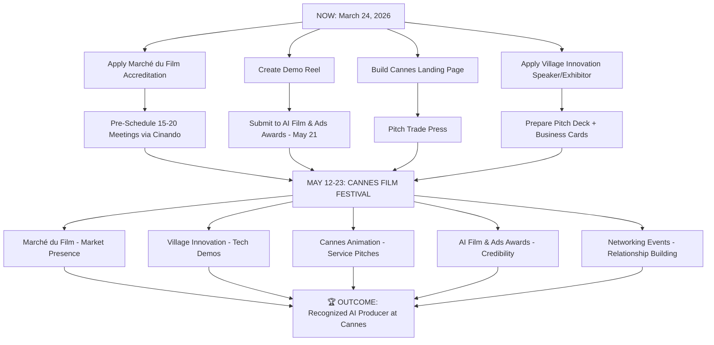

# 🎬 Cannes Film Festival 2026 — Multi-Agent Intelligence Report

**Mission:** Position you as a recognized AI producer at the 79th Cannes Film Festival (May 12–23, 2026) who creates world-class AI-driven films, series, and animations.

**Reference Benchmark:** [Arena Zero by Higgsfield](https://www.youtube.com/watch?v=qqcH-1Rk-ow) — the world's first AI action series, a 10-minute sci-fi pilot produced from scratch with generative AI. Tagline: *"We just saved $100,000,000 in 4 days."*

---

## Agent Team Overview

| # | Agent Role | Perspective |
|---|-----------|-------------|
| 1 | 🎥 The Producer/Seller | Selling films & closing deals at Marché du Film |
| 2 | 🆕 The First-Timer | First-time attendee navigating the festival |
| 3 | 😞 The One Who Didn't Go | Regret, barriers, and lessons from missing Cannes |
| 4 | 🤖 The AI Filmmaker | AI-generated content at Cannes — reception & opportunity |
| 5 | 📰 The Press/Journalist | Media coverage, access, and publicity strategies |
| 6 | 💰 The Buyer/Distributor | Acquisition strategies, what buyers actually want |
| 7 | 🏗️ The Volunteer/Crew | Behind-the-scenes logistics and insider access |
| 8 | 🚀 The Tech Innovator | Cannes Next, Village Innovation, startup exhibitors |
| 9 | 🤝 The Networking Strategist | Building connections that matter at Cannes |
| 10 | 📋 The Accreditation Expert | How to get in — badges, passes, deadlines |
| 11 | 🎯 The AI Consulting Strategist | Building a consulting brand at Cannes |
| 12 | 🎬 The Animation Specialist | Animation-specific opportunities and the Cannes Animation program |

---

## Agent 1: 🎥 The Producer/Seller

### How Films Are Sold at Cannes

The **Marché du Film** (Film Market) is the beating heart of commerce at Cannes — the world's largest film market generating **$600M–$1B annually** with **12,500+ professionals** from **140 countries** and **4,000 films** presented.

### Key Selling Mechanisms

- **Pre-sales:** Distribution rights sold at script stage to finance production
- **Market screenings:** ~1,500 dedicated film market screenings
- **"Goes to Cannes":** Showcases works-in-progress to sales agents, distributors, and festival selectors
- **Sales agents:** Represent films and negotiate deals (10–25% commission + $5K–$50K marketing fees)

### Producer Tips from Real Experiences

> *"Arrange all your meetings BEFORE you arrive. Buyers' schedules fill up weeks in advance. Social events are for making first contacts, not closing deals."* — Reddit, r/filmmakers

- **Producers Network:** Dedicated program hosting 370+ producers annually. Requires at least 1 feature-length film produced in the last 4 years with commercial theatrical release
- **Cinando database:** Essential tool for pre-scheduling meetings with industry contacts
- Micro-budget films (<$1M) that look high-quality are increasingly viable for profit

### What This Means for You

> [!IMPORTANT]
> You don't need to sell a finished film to be at the Marché du Film. You can present **works-in-progress**, pitch **AI consulting services**, or showcase your **AI production pipeline** as a technology exhibitor.

---

## Agent 2: 🆕 The First-Timer

### Real Reddit Accounts of First-Time Cannes Attendees

**On getting in:**
- The **"3 Days in Cannes"** program is the easiest consumer path (ages 18–28). App deadline: ~March 15, 2026
- Pick up your badge the day BEFORE your official start — you can access standby lines early
- Continuously refresh the ticketing platform; dropped tickets reappear

**On dress code:**
- Evening premieres at Lumière: **strict black-tie** (tuxedo mandatory for men, formal shoes — suede boots get rejected)
- Daytime is relaxed but smart casual minimum

**On costs:**
- Cannes is expensive. Many stay in **Nice** and commute by train (~30 min) to save 40–60% on lodging
- Grocery stores and park vendors for quick sandwiches between screenings
- Budget $150–$300/day for modest Cannes living; VIP concierge packages can run **$5,000–$25,000+**

**On the experience:**
> *"Come with an open mind and be ready to hustle. Networking matters more than how many films you see."* — Reddit

- Expect to see 3–5 films/day if you go hard
- Join **Facebook and WhatsApp groups** for real-time info and connections
- The standby line is your friend — patience pays off

---

## Agent 3: 😞 The One Who Didn't Go

### Why People Miss Cannes — and What They Regret

**Top barriers cited on Reddit:**
1. **Accreditation denial** — Even experienced professionals get rejected. The process is competitive and unpredictable
2. **Cost** — Flights + 12-day accommodation + food + events = easily $5,000+ even on a budget
3. **Timing conflicts** — Festival runs nearly 2 full weeks (May 12–23)
4. **Intimidation** — First-timers feel it's "not for them" — a self-limiting belief

**What they missed most:**
- Serendipitous encounters with industry legends
- The electric atmosphere of premieres and red carpet energy
- The credibility boost of saying "I was at Cannes"
- Unique networking that simply cannot happen virtually

**Alternatives people found:**
- **Beach Cinema (Cinéma de la Plage):** Free, open to public, no accreditation needed
- **Directors' Fortnight & Critics' Week:** More accessible parallel sections
- **ACID screenings:** Open to public, discovering emerging cinema
- **Cannes Lions** (June, different event): Creative/advertising industry — relevant for AI ads

> [!TIP]
> **Lesson:** Don't wait for the "perfect" moment. The biggest regret is not showing up. Even attending peripheral events creates opportunities that compounds over years.

---

## Agent 4: 🤖 The AI Filmmaker

### AI Films at Cannes — Current State of Play

**Dedicated AI Events:**
- **AI Film & Ads Awards** — Launched at Cannes May 2024. **Next edition: May 21, 2026.** Celebrates AI-enhanced filmmaking across scriptwriting, VFX, editing, and animation
- **Cannes Film Awards** explicitly accepts AI-generated content (must disclose AI use in credits)
- **Immersive Competition** features AI-driven installations

**Industry Reality:**
- The 2025 Festival de Cannes prominently featured AI-generated films for the first time
- **Cannes Next** (at Marché du Film) dedicated an entire section to AI's impact on creative and business opportunities
- 65+ AI-centric film studios launched globally since 2022
- Global AI in film & entertainment market projected to reach **$4.8B by 2026**

### Arena Zero as Your Benchmark

Higgsfield's **Arena Zero** represents the frontier:
- 10-minute sci-fi pilot, fully AI-generated
- Uses **Higgsfield Cinema Studio** (simulates real cameras, lenses, lighting, scene continuity)
- Positioned as the first AI streaming platform
- Claims to have "saved $100M in 4 days"

> [!IMPORTANT]
> **Your competitive advantage:** Arena Zero is impressive technically but still feels "AI." The market gap is **hybrid AI + human creativity** — productions that leverage AI for efficiency while maintaining the emotional depth and artistic quality that critics at Cannes value.

### What Cannes Really Wants from AI

Based on festival programming and jury comments:
1. **Artistic vision first, technology second** — AI as a tool, not the story
2. **Transparency** — Disclose AI usage openly; it builds credibility, not skepticism
3. **Hybrid approaches** — AI-augmented human filmmaking is more respected than pure AI
4. **Cost disruption narratives** — Studios want to know: "How does this save money AND look better?"

---

## Agent 5: 📰 The Press/Journalist

### How Media Works at Cannes

- **4,000+ journalists** from 90 countries and 2,000+ media outlets attend
- Hierarchical badge system: Yellow (basic press) → Pink → White (VIP access)
- Press accreditation opens February, closes March/April
- Dedicated Press Room, Wi-Fi area, and "Journalists' Terrace"

### How to Get Coverage as an AI Producer

1. **Build relationships with trade press BEFORE Cannes:** Screen Daily, Variety, Hollywood Reporter, IndieWire, Deadline
2. **Create a compelling press kit:** Your AI production pipeline, demo reel, Arena Zero-level quality samples
3. **Pitch the "disruption" angle:** Journalists love the tension between traditional cinema and AI — position yourself at the center of that debate
4. **Leverage the influencer trend:** Cannes is debating the role of social media vs traditional journalism. Being an AI creator who IS the story gives you dual advantage

> [!TIP]
> Consider getting your own **press accreditation** through a media outlet or blog you publish regularly. This gives you access to press screenings, photo calls, and press conferences — much better access than standard festival accreditation.

---

## Agent 6: 💰 The Buyer/Distributor

### What Buyers Actually Want at Cannes

Major active buyers: **Neon, Mubi, A24, Apple, Netflix, Amazon Prime Video**

**Their acquisition criteria:**
- Award-potential films with strong narratives
- Recognizable talent (even voice actors for animation)
- Completed, high-quality production OR compelling works-in-progress
- Fresh angles — AI is now a "fresh angle" that attracts attention

**Deal dynamics:**
- Best prices are secured in the first 2–3 days of the market
- Pre-acquisitions at script stage are increasingly common
- Co-buying has become a strategy to manage risk
- Micro-budget films that punch above their weight are the sweet spot

### Your Positioning for Buyers

> [!IMPORTANT]
> **As an AI producer, you're not just selling a film — you're selling a production model.** Buyers are interested in:
> - Dramatically lower production costs (40–60% reduction)
> - Faster turnaround (weeks → days)
> - Scalable content creation across formats (theatrical, streaming, social)
> - The "first to market" credibility of backing AI-produced premium content

---

## Agent 7: 🏗️ The Volunteer/Crew

### Behind-the-Scenes Access Points

- **Critics' Week (Semaine de la Critique):** Actively seeks volunteers — receive screening tickets as perks
- **American Pavilion:** Student programs providing operational exposure (fee-based)
- **Creative Mind Group:** Internship connections with entertainment companies at Cannes
- **International Pan African Film Festival:** Volunteer logistics roles

### Insider Knowledge

- Festival uses **paid staff**, not large volunteer armies — access is limited and competitive
- French fluency often required for official festival internships
- Applications close by **end of November** for the following year's festival
- Even logistics roles give you a "credentialed insider" perspective that impresses at networking events

---

## Agent 8: 🚀 The Tech Innovator

### Cannes Next & Village Innovation — Your Best Entry Point

**Village Innovation** (launched 2025): A **1,000m² dedicated innovation space** within the Marché du Film at Village International (Pantiero).

**What it offers:**
- 500m² pavilion for talks, demos, and showcases
- 250m² terrace overlooking the port (premium networking)
- Programming in partnership with leading tech companies and startups
- Focus areas: **Generative AI, Virtual Production, Immersive Storytelling, XR**

**Who attends:** C-Level executives, producers, AI experts, entrepreneurs, startups, investors

> [!IMPORTANT]
> **This is your launchpad.** The Village Innovation is specifically designed for people like you — AI innovators at the intersection of technology and cinema. You could:
> 1. **Apply as an exhibitor/speaker** to demo your AI production pipeline
> 2. **Host a panel** on hybrid AI+human filmmaking
> 3. **Network directly** with studio executives who are actively seeking AI solutions
> 4. **Showcase before/after** comparisons of AI vs traditional production (cost, time, quality)

**Exhibitor options:** The Marché du Film offers booth bookings and pavilion hosting.

---

## Agent 9: 🤝 The Networking Strategist

### The Art of Networking at Cannes

Based on first-person Reddit accounts and industry guides:

**Before Cannes:**
1. Use **Cinando** (official industry database) to research and pre-schedule meetings
2. Join Cannes-related **Facebook/WhatsApp groups** for real-time connections
3. Reach out to contacts at studios, distributors, and tech companies — schedules fill up fast
4. Prepare non-laminated business cards (so people can write notes on them)
5. Have your **elevator pitch** down to 30 seconds

**During Cannes:**
1. **Be bold, friendly, interested, and enthusiastic** — this opens doors to exclusive events
2. Cocktail parties, gala dinners, and yacht events are where multi-million-dollar deals start
3. Dress impeccably — it opens doors and builds confidence
4. Prioritize **networking over screenings** if you're there for business
5. Follow up the same day with a brief, personalized email

**The AI Producer Angle:**
- You ARE the story right now. "AI producer" is a conversation starter everywhere at Cannes
- Carry a tablet/laptop with a demo reel ready to show
- Offer free 15-minute consultations in your pitch — it generates leads
- Position yourself not as replacing human filmmakers but as **empowering** them

---

## Agent 10: 📋 The Accreditation Expert

### Your Accreditation Options for Cannes 2026

| Accreditation Type | Cost | Who It's For | Access Level |
|---|---|---|---|
| **Festival Accreditation** | Free | Film industry professionals | Festival venues + official screenings |
| **Marché du Film** | ~€300 | Film market professionals | Full market access + networking events |
| **Press Accreditation** | Free | Journalists, media reps | Press screenings, conferences, red carpet |
| **"3 Days in Cannes"** | Free | Ages 18-28, cinema enthusiasts | Official Selection screenings (3 days) |
| **Cinéphiles** | Free | Local residents, film groups | Selected screenings |
| **VIP Packages** | $5,000–$25,000+ | Anyone with budget | Red carpet, premieres, exclusive parties |

### Critical Deadlines (2026)

| Deadline | Item |
|---|---|
| ~~March 2~~ | Short film submissions (CLOSED) |
| ~~March 13~~ | Feature film submissions (CLOSED) |
| ~~March 15~~ | "3 Days in Cannes" applications (CLOSED) |
| **April 1** | Cannes Classics registration deadline |
| **April 1** | Late accreditation begins (€224 fee) |
| **April 15** | Standard accreditation portal closes |
| **~May 4** | Online ticketing opens |
| **~May 8** | Ticket reservations available |
| **May 12** | Festival & Marché du Film open |
| **May 20** | Marché du Film closes |
| **May 23** | Festival closes |

> [!CAUTION]
> **Time is critical.** You are reading this on March 24, 2026. Standard accreditation closes April 15. Late accreditation (starting April 1) costs €224. Act NOW.

### Recommended Accreditation Path for You

1. **Primary: Marché du Film Accreditation** (~€300) — This gives you full access to the film market, Cannes Next, Village Innovation, Producers Network events, and all networking opportunities
2. **Secondary: Press Accreditation** — If you publish regularly (blog, YouTube channel, newsletter about AI filmmaking), apply as media
3. **Backup: Late Festival Accreditation** — Available April 1 for €224 if other routes fail

---

## Agent 11: 🎯 The AI Consulting Strategist

### Building Your "AI Producer" Brand at Cannes

**The Market Opportunity:**
- Major studios (Warner Bros, Disney, Netflix) are investing in AI to reduce production costs by **40–60%**
- By 2026, AI previsualization is expected to be **mandatory for budget greenlighting**
- Post-production timelines collapsing from weeks to **days or even hours**
- Producers are shifting to curators and strategic leaders — they NEED AI consultants

**Your Consulting Positioning:**

```
┌─────────────────────────────────────────────┐
│     YOUR VALUE PROPOSITION AT CANNES        │
├─────────────────────────────────────────────┤
│                                             │
│  "I help productions create cinema-quality  │
│   content using AI — faster, cheaper, and   │
│   with artistic integrity."                 │
│                                             │
│  Services:                                  │
│  • AI Production Pipeline Design            │
│  • Hybrid AI+Human Workflow Consulting      │
│  • AI-Powered Pre-visualization             │
│  • Full AI Animation & Short Film Creation  │
│  • Cost Reduction & Efficiency Audits       │
│  • AI Talent Training for Crew              │
│                                             │
└─────────────────────────────────────────────┘
```

**How to Stand Out from Other AI Companies:**

1. **Show, don't tell.** Bring a polished 3–5 minute AI-produced short film or animation — Cannes quality, not YouTube quality
2. **Quantify results:** "$X saved, Y weeks faster, Z% cost reduction" — producers think in numbers
3. **Reference Arena Zero** and position yourself as going BEYOND it with hybrid approaches
4. **Target Cannes Animation** — a specialized section of the Marché du Film dedicated to animation. This is your natural habitat
5. **Name your approach** — Having a branded methodology (e.g., "Hybrid Cinema AI™") creates memorability

**Concrete Actions for May 2026:**

| Week | Action |
|---|---|
| **Now–Apr 1** | Apply for Marché du Film accreditation |
| **Now–Apr 15** | Create a 3-5 min demo reel at highest possible quality |
| **Now–Apr 15** | Build a one-page website: YourName.com/cannes |
| **Now–Apr 15** | Apply to speak/exhibit at Village Innovation |
| **Apr 1–May 1** | Pre-schedule 15-20 meetings via Cinando |
| **Apr 1–May 1** | Reach out to trade press (Variety, Screen Daily, etc.) |
| **Apr 15–May 1** | Print business cards, prepare pitch deck (max 10 slides) |
| **May 1–12** | Book accommodation (Nice recommended for budget) |
| **May 12–20** | Attend Marché du Film, Village Innovation, Cannes Animation |
| **May 12–23** | Network aggressively — target 5-10 meaningful connections/day |

---

## Agent 12: 🎬 The Animation Specialist

### Cannes Animation — Your Secret Weapon

**Cannes Animation** is a specialized program within the Marché du Film dedicated to the animation industry. It brings together:
- Animation studios
- Distributors specializing in animated content
- Technology companies (VFX, AI, rendering)
- Investors interested in animation

**Why this matters for you:**
- Animation is where AI has the **strongest immediate impact** — generating backgrounds, in-betweens, character poses, entire scenes
- The bar for "AI-quality" in animation is significantly lower than live-action — anime and stylized animation can be AI-generated today at near-professional quality
- Buyers are actively seeking animated content for streaming platforms

**Strategy:**
1. Create a **stunning AI-animated short** (2–5 minutes) to use as your calling card
2. Target the **Cannes Animation** section specifically for meetings
3. Pitch your AI animation pipeline as a service for studios looking to reduce costs
4. Connect with distributors who specialize in animation for international markets

---

## 🎯 Your Master Strategy — The Big Picture



### Your Top 5 Immediate Actions

> [!CAUTION]
> **You have ~3 weeks until accreditation closes.** Every day matters.

1. **TODAY:** Register on [festival-cannes.com](https://festival-cannes.com) "My Account" portal and apply for **Marché du Film accreditation** (~€300)
2. **THIS WEEK:** Begin creating your best possible AI-produced demo reel — aim for Arena Zero quality or better, with a hybrid AI+human touch
3. **THIS WEEK:** Set up a Cinando account and start identifying key contacts (distributors, buyers, Cannes Next organizers)
4. **NEXT WEEK:** Apply to speak or exhibit at Village Innovation / Cannes Next
5. **BY APRIL 15:** Have your demo reel, pitch deck, landing page, and press kit ready

---

## 📚 Key Resources

| Resource | URL | Purpose |
|---|---|---|
| Festival de Cannes | festival-cannes.com | Official festival, accreditation |
| Marché du Film | marchedufilm.com | Market accreditation, exhibitions |
| Cinando | cinando.com | Industry database, meeting scheduling |
| AI Film & Ads Awards | filmawards.ai | AI-specific awards at Cannes |
| Cannes Next | marchedufilm.com/programs/cannes-next | Innovation & tech pavilion |
| Higgsfield (Arena Zero) | higgsfield.ai | Benchmark reference |
| FilmFreeway | filmfreeway.com | Film submission platform |

---

*This report was compiled on March 24, 2026, from 12 specialized research perspectives spanning Reddit communities, industry publications, official Cannes sources, trade press, and first-person accounts.*
